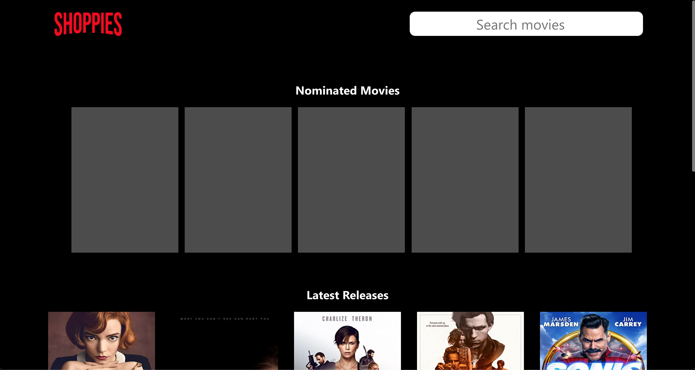
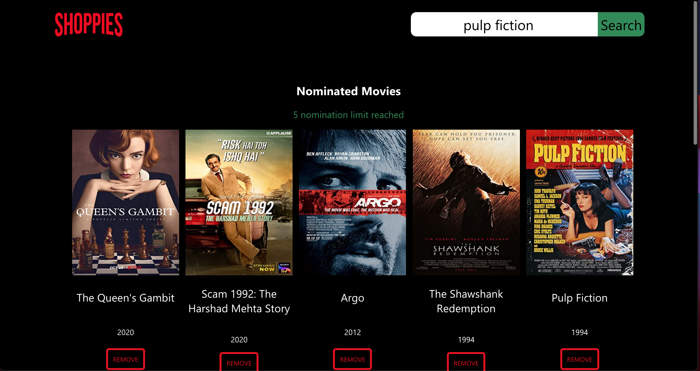

SHOPIFY- SUMMER 2021 INTERNSHIP CHALLENGE

[SHOPPIES](https://raghav0811.github.io/shopify-summer-2021-web-developer-internship/)

[Challenge Link](https://docs.google.com/document/d/1AZO0BZwn1Aogj4f3PDNe1mhq8pKsXZxtrG--EIbP_-w/edit)

# App Features

Loads latest releases from the OMDB API on initial load

User can choose a maximum of 5 movies to nominate

User can search for movies using the search bar

The app has a responsive design and has been made using React (create-react-app)

Nominations are stored in the browser's local storage

